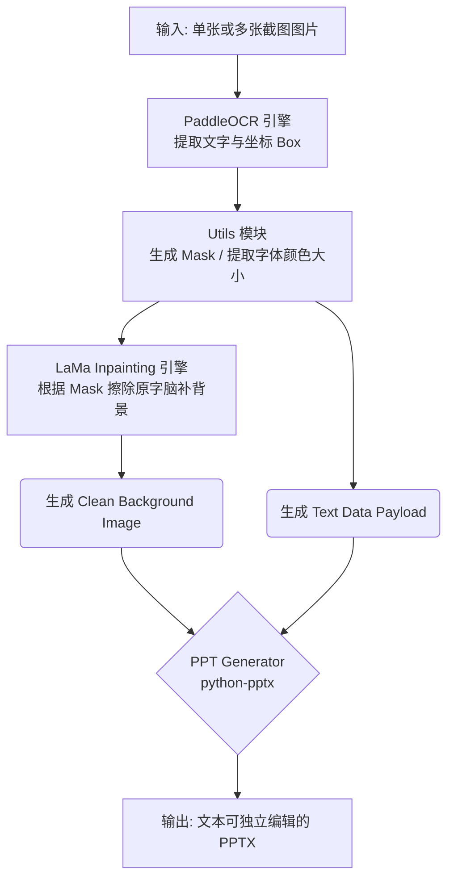

# NotebookLM PPT Converter - 产品架构与设计文档

## 1. 产品概述 (Product Overview)

* **产品定位**：一款主打**“零云端成本、绝对隐私安全、离线可用”**的 PC 端本地幻灯片逆向工程与重构软件。
* **核心功能**：将带有复杂排版和高光渐变背景的各类演示截图（如 NotebookLM 生成界面、在线课程、PDF截屏等）自动转换为**文本完全可编辑**、且**原图背景无痕保留**的 `.pptx` 格式演示文稿。
* **核心业务价值**：解决市面上轻量级转换工具“排版串行识别错位”和“擦除原字后背景糊化”的业务痛点。即便在处理分栏复杂、背景元素丰富的纽约主题等高级演示文稿时，也能以接近原生级别的还原度，交付供人工二次编辑的商用级 PPT。

---

## 2. 演进历程与技术沉淀 (Evolution & Phase 1 Tech Debts)

在原型阶段，我们以极客精神完成了核心业务逻辑的摸索与技术边界测试：

1. **构建了从图到 PPT 的自动化管线**：尝试基于 `img2ppt` 架构，打通了读取文件夹图片、计算像素到 PPT 物理尺寸比例转换、动态生成 PPT 文件的全链路。
2. **第一代 OCR 与视觉算法实验**：
   * 采用 `pytesseract` (Tesseract) 跑通中英文双语文本坐标定位。
   * 结合 `OpenCV`，利用 `cv2.inpaint` 传统数学算法完成了“定位 -> 遮罩生成 -> 擦除 -> 填补”链路。
3. **探明技术天花板与生态排障**：
   * **排版天花板**：Tesseract 天然缺乏“版面分析（Layout Analysis）”能力，面对“1789: The First Capital”等多栏并列排版时导致排版碎片化乃至乱码。
   * **视觉天花板**：OpenCV 算法本质是单纯的数学涂抹（和稀泥），在处理带有高光裂缝等复杂背景时产生明显的涂抹痕迹。
   * **生态排障**：发现了超前 Python 版本（如 Python 3.14）导致的底层环境断层和各种文件锁报错，明确了将基础设施降级至工业级稳定版本（Python 3.11）的绝对必要性。

---

## 3. 当前技术架构设计 (Current Architecture - Phase 2)

基于前期的摸索，我们现已完成了**核心引擎重构**，从“极客尝试”正式迈入“正规军商业级别”。以下是软件目前的解耦架构：

### 3.1 核心组件划分

* **🧠 大脑（识别与版面引擎）：[ocr_engine.py](file:///c:/Users/lewis/.gemini/antigravity/scratch/notebook_ppt_converter/ocr_engine.py)**
  * **选型**：全面替换为国内最强的 **PaddleOCR**。
  * **能力**：天生具备商业级的版面感知与文字对齐能力，直接切割文本块（Bounding Boxes），从根本上消灭了分栏错位和排版碎片化问题。
* **🖌️ 画笔（AI 图像修复引擎）：[inpainting_engine.py](file:///c:/Users/lewis/.gemini/antigravity/scratch/notebook_ppt_converter/inpainting_engine.py)**
  * **选型**：引入轻量级深度学习修复模型 **LaMa (Large Mask Inpainting, `simple-lama-inpainting`)**。
  * **能力**：利用深度学习强大的空间“脑补”能力替代 OpenCV，即使面对带纹理和高光的背景元素，也能做到“大隐隐于市”级别的无痕去字。
* **⚙️ 装配间（幻灯片生成器）：[ppt_generator.py](file:///c:/Users/lewis/.gemini/antigravity/scratch/notebook_ppt_converter/ppt_generator.py) & [utils.py](file:///c:/Users/lewis/.gemini/antigravity/scratch/notebook_ppt_converter/utils.py)**
  * **核心支撑**：基于 `python-pptx` 构建。
  * **视觉优化支持**：[utils.py](file:///c:/Users/lewis/.gemini/antigravity/scratch/notebook_ppt_converter/utils.py) 中封装了基于图片文字区域自动吸取原生对比色（`extract_text_color`）、自动计算字体字号比例（`estimate_font_size`）的算法，最大程度继承原图视觉基因。
* **🔗 骨架神经（主控制调度）：[main.py](file:///c:/Users/lewis/.gemini/antigravity/scratch/notebook_ppt_converter/main.py)**
  * 统筹协调文件 I/O、PaddleOCR 分析、Mask 矩阵生成、LaMa 前向推理和 PPTX 封装这五大生命周期。

### 3.2 运行时数据流向 (Data Flow)

---

## 4. 下一步开发执行路线图 (Actionable Roadmap)

目前我们已经跨越了 Step 1 (重构基础环境) 和 Step 2 (核心架构升级)，项目拥有了一个完美的发动机。为了将它转化为面向最终用户的独立软件，接下来的攻坚任务如下：

### Step 3：打造用户界面（GUI 图形化）
* **目标**：彻底摆脱 PowerShell 黑窗口与命令行传参。
* **UI 交互**：
  * **输入输出区**：一键“选择图片文件夹”、“选择输出位置”。
  * **状态展示区**：实时的绿色进度条、对当前正在处理的幻灯片展现微缩缩略图。
* **技术方案**：基于 `PyQt6` 或 `Tkinter` (若考虑严格控制打包体积) 编写独立前端，通过子线程(Thread)调用 [main.py](file:///c:/Users/lewis/.gemini/antigravity/scratch/notebook_ppt_converter/main.py) 内部的核心逻辑以避免界面卡死。

### Step 4：软件打包部署（终极分发态）
* **当前准备**：已写出雏形脚本 [build.ps1](file:///c:/Users/lewis/.gemini/antigravity/scratch/notebook_ppt_converter/build.ps1)，成功验证了 `PyInstaller` 加载 `PaddleOCR` 等大体积模块的 `--windowed`、`--onedir` 目录打包机制。
* **优化方向**：
  * **瘦身**：因为涉及 PyTorch 和 PaddlePaddle，直接打包体积可能逼近 2GB+。后续需要剔除不必要的 `site-packages` 冗余。
  * **分发**：以绿色免安装版（文件夹模式）为最终载体，确保任何 Windows 用户解压后直接双击 `.exe` 就能获得拥有极客内核的企业级幻灯片转换工具。

---
> **🚀 项目愿景 (Vision)**
> 我们正在做的不仅是一个脚本，而是一个能有效释放办公生产力的桌面效能工具。它承载着从 OCR、AI Inpainting 到 PPT DOM 结构重构的复杂逻辑，但呈供给用户的，将只有界面上的一个简单“转换”按钮。
